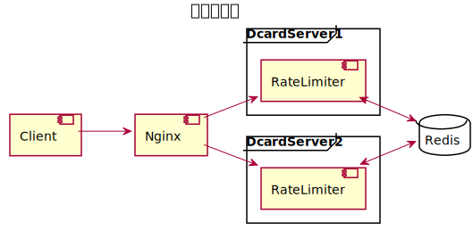

# Dcard Homework

實作一個 server 滿足下面要求

- 每個 IP 每分鐘僅能接收 60 requests
- 在首頁顯示目前的 request 數量，超過限制的話則顯示 "Error"
- 可使用任意資料庫
- 附上測試
- 不使用任何現成 rate limit

## 目錄

- [系統設計](#系統設計)
- [系統安裝](#系統安裝)
- [Production Server](#Prdouction-Server)

### 系統設計

#### RateLimiter設計

##### 資料庫選用

使用 **Redis** 儲存不同 ip 的 rate limiter 資訊，主要原因：

- 在分散式架構下，多個 server 如果要用統一的 rate limiter 去限制整體 cluster 的流量，需要有一個 db server 儲存資料
- Redis 是 in-memory db，讀寫效能佳，且使用 lua 腳本能在避免 race condition 的情況下保持效能

##### 演算法設計

設計兩種演算法 **Leaky Bucket** 和 **Simple Counter**

**Leaky Bucket**
透過計算 request rate (i.e 每秒消耗多少個 request) 來動態調整 client 可以發送的 request 數，而 client 的發送的 request 數量會在設定的時間後被清除

例如：每個 IP 每分鐘僅能接收 60 requests，換言之 request rate 1/sec，如果 client 在第一秒發送 60 requests，bucket 會被填滿，在 client 發送第 61 個 request 時，會被 block 住，而由於 server 消耗 request 的速度 1/sec，因此在過 1sec 後，client 就可以發第 61 個 request，但如果過 1sec 後，連發第 61, 62 個 request，第 62 個 request 會被 block 住。

**Simple Counter**
使用一般計數器計計算一分種之內收到的 request 數量，如果大於設定上限則會顯示 error，計數器會在第一個 request 到達時設定重置時間，一旦重置時間到達計數器會重新設定為 0。

> **leaky bucket vs simple counter**
使用一般的 counter 去紀錄 request 數，然後在一段時間後重置，這種流量限制方法在 request 短時間內爆發大量的時候會有缺陷，例如，當 client 在第
一秒的時候發送 60 個 request，那麼 client 必須在等待 59sec 才能在發下一個 request，而 leaky bucket 透過 request rate 解決上述問題。

#### API 設計

##### Root Endpoint

```shell
# local
curl http://localhost/

# production
curl https://209.97.172.117.nip.io/
```

正常的 response json format

```json
{
  "ip": "150.116.49.185",
  "requestCount": 1,
  "remainingRequest": 59,
  "resetAfter": "60s",
  "resetAt": 1609050768
}
```

rate limit 達到限制的 error json format

```json
{
  "error": {
    "code": 429,
    "details": {
      "rateLimitRefreshAfter": "59s",
      "rateLimitRemainingRequest": 0,
      "rateLimitRequestCount": 61,
      "rateLimitRequestIP": "150.116.49.185",
      "rateLimitResetAt": 1609050914,
      "traceID": "b0096d2a-6d1c-48e8-8b41-f392c7af8ee2"
    },
    "message": "Too Many Requests"
  }
}
```

促發 rate limit 限制的腳本

```shell
cat <<EOF | sudo /bin/zsh
for i in {1..5};
do
  curl -s -X GET http://209.97.172.117.nip.io/ -X GET http://209.97.172.117.nip.io/ \
      -X GET http://209.97.172.117.nip.io/ -X GET http://209.97.172.117.nip.io/ \
      -X GET http://209.97.172.117.nip.io/ -X GET http://209.97.172.117.nip.io/ \
      -X GET http://209.97.172.117.nip.io/ -X GET http://209.97.172.117.nip.io/ \
      -X GET http://209.97.172.117.nip.io/ -X GET http://209.97.172.117.nip.io/ \
      -X GET http://209.97.172.117.nip.io/ -X GET http://209.97.172.117.nip.io/ > /dev/null
done
curl http://209.97.172.117.nip.io/
EOF
```

##### Get Your Guardian Animal Endpoint

```shell
# local
curl "http://localhost/guardian_animal?name=小明"

# production
curl "https://209.97.172.117.nip.io/guardian_animal?name=小明"
```

透過你的名字找屬於你的守護動物，相同的名字會有一樣的守護動物

```json
{
  "animal": "monkey",
  "name": "小明",
  "description": "creative"
}
```

---

### 系統安裝

#### 啟動服務

```shell
git clone https://github.com/vx416/dcard-hw && cd ./dcard-hw
make redis # 如果local 沒有 redis server
make app.yaml
make run
```

#### 執行測試

```shell
go test ./...
```

---

### Production Server

#### domain

https://209.97.172.117.nip.io/


#### rate limiter strategy

採用 simple counter 流量限制

#### 架構圖

